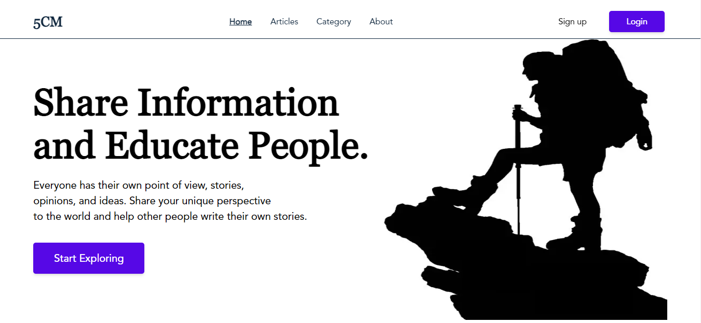
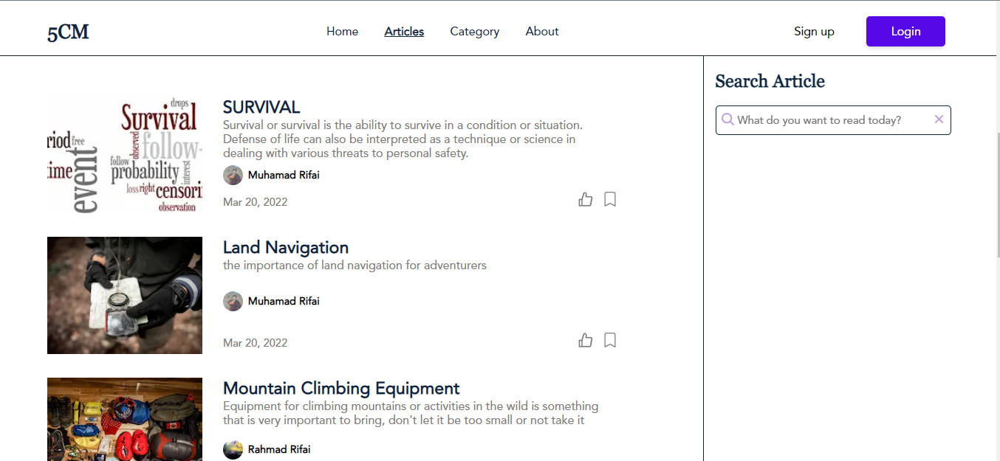
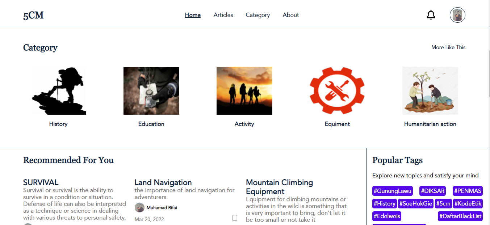

# 5CM

**5CM** is a platform for sharing news about nature, so when you have the desire to share information (which is generally in the form of writing) you can use 5CM


## Built With

- [React.js]
- [Next.js]


## Installation

1. Clone the repo
   ```sh
   git clone : https://github.com/MuhDRifai/NewsApps-5CM.git
   ```
2. Install NPM packages
   ```sh
   npm install
   ```
3. Start the Application
   ```sh
   npm run dev
   ```

## Demonstration

Demo : https://news-apps-5-cm.vercel.app/

## Snippets

Here are some snippets about this app:

- Home




- Login


- Article




- home Category




